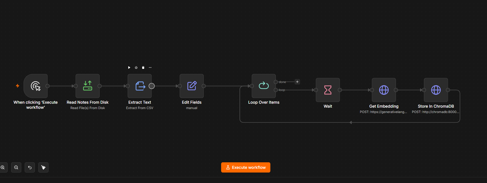
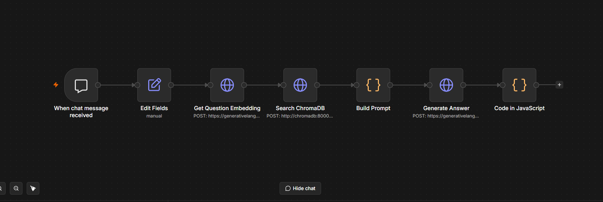

# RAG Fitness Coach

A self-hosted Retrieval-Augmented Generation (RAG) Q&A chatbot built from scratch to learn RAG architecture end-to-end.

## What it does
Ask any fitness question in a chat interface, and get an answer generated from a curated set of fitness Q&A data — retrieved by semantic meaning, not just keyword matching.

## Stack
- **Orchestration**: n8n (self-hosted via Docker)
- **Vector database**: ChromaDB
- **Embeddings & generation**: Google Gemini API (`gemini-embedding-001` for embeddings, `gemini-3.5-flash` for chat)
- **Dataset**: Public fitness Q&A dataset (100 curated Q&A pairs)

## Architecture

## Screenshots

### Ingest Workflow

### Chat Workflow

**Ingest workflow** (`n8n-workflows/ingest-workflow.json`):
CSV → extract rows → combine Q&A into text → loop (rate-limit safe) → embed via Gemini → store in ChromaDB

**Chat workflow** (`n8n-workflows/chat-workflow.json`):
User message → embed question → semantic search in ChromaDB (top 3 matches) → build grounded prompt → Gemini generates answer → reply in chat UI

## Setup
1. `docker compose up -d`
2. Import both workflow JSONs from `n8n-workflows/` into n8n at `localhost:5678`
3. Replace `YOUR_GEMINI_API_KEY` placeholders with your own Gemini API key
4. Run the ingest workflow once to populate ChromaDB
5. Activate the chat workflow and open its chat URL

## What I learned building this
- Chunking strategy and why Q&A pairs work better as natural units than fixed-size text chunks
- Handling API rate limits with batched loops instead of naive parallel requests
- Prompt engineering for grounded, context-aware answers
- Debugging a full RAG pipeline: embeddings, vector search, and generation as separate, testable stages
